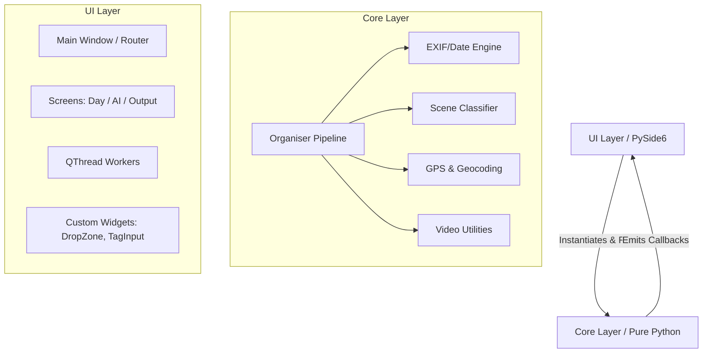

# Photorg Architecture

## Executive Summary

Photorg is a modern, high-performance desktop application built with Python and PySide6 (Qt) that automates the tedious process of organising vacation photos and videos. It groups media chronologically and uses zero-shot AI classification (OpenAI's CLIP) alongside GPS reverse geocoding to categorize media into semantic folders (e.g., "Beach", "Eiffel Tower").

**Key Value Propositions:**
- **Local AI:** Processes media locally, ensuring absolute privacy.
- **Performance:** Optimised for large datasets via threading, burst-photo optimization, and lightweight video frame extraction.
- **Robustness:** Built on a decoupled Core/UI architecture with rigorous unit and end-to-end testing (80+ passing tests).
- **Usability:** Minimalist, drag-and-drop interface styled with a custom dark theme.

---

## 1. High-Level Architecture

The application is structured into two completely decoupled layers: **Core** and **UI**.

### Why this design?
1. **Testability:** Core business logic (`Organiser`, `SceneClassifier`) has zero Qt dependencies, allowing it to be tested blazingly fast using standard `pytest`.
2. **Maintainability:** The GUI can be entirely rewritten or replaced (e.g., with a CLI or web app) without changing a single line of the Core logic.
3. **Thread Safety:** Heavy processing tasks (I/O, AI inference) run in background threads, communicating with the main GUI thread strictly via Qt Signals to prevent freezing.

---

## 2. Core Components

### Organiser Pipelines (`organiser.py`, `ai_classifier.py`)
The heavy lifting is done by the `DayOrganiser` and `AIOrganiser` classes.
- They scan directories recursively for valid media (`file_utils.py`).
- They parse capture dates and group items chronologically.
- They support cancellation via `threading.Event` and report progress through simple callbacks.

### EXIF & Geolocation (`exif.py`, `geocoder.py`)
- **EXIF Extraction:** Reads the `Exif` sub-IFD using Pillow to find accurate `DateTimeOriginal` and `GPSInfo`. It employs a multi-tiered fallback (Sub-IFD -> Root IFD -> File Modification Time) ensuring no photo is left behind.
- **Reverse Geocoding:** Converts GPS coordinates to real-world names (e.g. "Colosseum") via the OpenStreetMap (Nominatim) API. Results are LRU-cached and gracefully degraded on network failure.

### AI Scene Classification (`scene_model.py`)
- **Zero-Shot CLIP:** Uses the Hugging Face `transformers` library with OpenAI's `clip-vit-base-patch32`.
- **Dynamic Tags:** Because it is a zero-shot model, the user can input arbitrary tags (e.g., "snow", "museum", "dog") at runtime. The model calculates the cosine similarity between the image embeddings and the text prompts, returning the best match.
- **Lazy Loading:** The ~600MB model is only loaded into memory when AI classification actually begins, keeping standard app startup instantaneous.

### Media Utilities (`file_utils.py`, `video_utils.py`)
- **Video Support:** Instead of loading full videos into memory, `imageio` safely extracts just a single frame at the 1-second mark for AI classification, keeping RAM usage extremely low.
- **Safe File Operations:** Handles file collisions (e.g., two `IMG_001.jpg` files) by automatically appending a counter (`IMG_001_1.jpg`) and ensures parent directories are safely created.

---

## 3. Performance & Optimizations

If someone brings thousands of photos, processing each with a deep neural network is slow. Photorg implements specific strategies to mitigate this:

### 1. Burst Optimization
Often, users hold down the shutter button or take 10 photos of the exact same scene in one minute.
- **How it works:** The algorithm groups photos taken within 60 seconds of each other into a "burst". It only runs AI classification on the **first photo** (the head) and automatically applies that scene tag to the entire group.
- **Result:** Saves up to 80% of processing time on rapid-fire vacation shots.

### 2. Geocoding Priority
AI classification requires heavy matrix multiplications. Reverse geocoding is a simple HTTP request.
- **How it works:** If a photo has GPS coordinates, Photorg queries OpenStreetMap. If a famous monument or location type is returned (e.g., "Eiffel Tower" or "Beach"), the AI classification step is **completely bypassed**.

### 3. Asynchronous Workers
The UI layer wraps the Core organisers in `QThread` subclasses (`day_worker.py`, `ai_worker.py`). This prevents the application from showing a "Not Responding" white-out during heavy copies.

---

## 4. UI / UX Design

### Built with PySide6 (Qt)
- **Minimalist Theming (`theme.py`):** The app uses Qt Style Sheets (QSS) injected globally. It overrides the default Qt Fusion style with a cohesive dark palette, rounded corners, and custom padding.
- **State Management:** A centralized `QStackedWidget` manages routing between the three main views (Day, AI, Output).
- **Custom Widgets:**
  - `TagInput`: A tokenizing text field (like email clients) allowing users to add/remove classification tags interactively. Built safely to prevent C++ pointer deletion crashes.
  - `DropZone`: Implements drag-and-drop mechanics with hover states and file-dialog fallbacks.
  - `OutputScreen`: Provides a real-time, interactive filesystem tree preview of the generated folders, allowing users to verify the output before fully exploring in the OS.

---

## 5. Testing & CI Strategy

With 80+ tests, the application relies on `pytest` and `pytest-qt`.
- **Unit Tests (`tests/unit/`):** Exhaustively tests edge cases in core logic (e.g., malformed EXIF strings, file collisions, empty directories).
- **Regression Tests (`tests/unit/test_ui_regressions.py`):** Specific tests that map 1:1 to previously patched UI bugs (e.g., QSS syntax errors, dangling pointers) ensuring they never return.
- **End-to-End Tests (`tests/e2e/`):** Full pipeline tests that create temporary directories, generate dummy image/video files, run the entire routing logic, and assert the final directory tree matches expectations.

---

## 6. Distribution

Photorg is bundled using **PyInstaller**.
- The `photorg.spec` explicitly collects complex dynamically-loaded dependencies (`transformers`, `torch`, `safetensors`).
- The application ships as a single `.exe` installer (or standalone binary), meaning non-technical end-users do not need to install Python, configure virtual environments, or deal with `pip`. They just click and run.
